# Benchmarking Analysis

## 1. Overview and Selected Applications

For the requirements elicitation of the project, we conducted a market analysis to identify established features, gather innovative ideas, and understand UI/UX best practices in similar applications.

The following applications were selected for analysis:

- [Gymrats](https://www.gymrats.app/) (Fitness app that allows users to create and join training challenges with friends and family)
- [Earth Hero](https://www.earthhero.org/es/) (Global app for measuring carbon footprint and eco-friendly actions)
- [Gira](https://gira.com.ec/) (Ecuadorian waste management project that promotes the circular economy through recycling)
- [AWorld](https://aworld.org/) (The official app for the UN's "Act Now" campaign, using educational content, gamified challenges, and collective Targets to promote sustainable habits)

---

## 2. Detailed Application Analysis

### 2.1 AWorld

"Act Now" serves as the official app for the United Nations' campaign, functioning as an educational tool with strong credibility. Its main purpose is to engage a global community in climate action by allowing users to calculate their carbon footprint and participate in gamified challenges to collectively save CO2, water, and energy.

#### Features and Characteristic Analysis

- #### Feature: Questionnaire-Based Carbon Footprint Calculation
  The app calculates a user's initial carbon footprint through a guided questionnaire about their lifestyle habits. This feature provides a personalized baseline, giving users a tangible starting point and a metric against which they can measure their progress.

**Visual Evidence:**
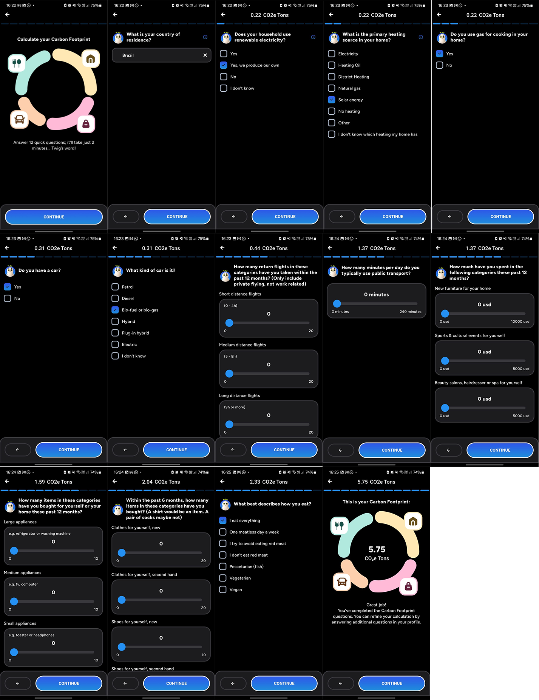

- #### Feature: Collective Target-Oriented Gamification
  AWorld employs a gamification system with points, levels, and badges to motivate users. However, its competition mechanics are focused on collective achievement rather than direct rivalry. Users participate in time-based, public "Collective Challenges" where they contribute to a large-scale shared Target, such as a global reduction in CO₂.

**Visual Evidence:**
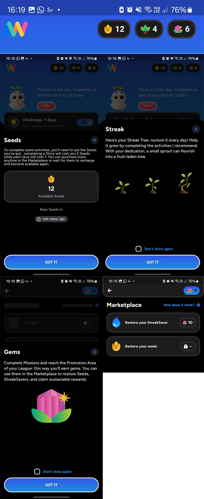

- #### Feature: Daily Streak Challenge
  This feature stimulates the user to open the app daily to maintain their engagement streak. It offers rewards within the gamification system for users who successfully keep their streak active.

**Visual Evidence:**
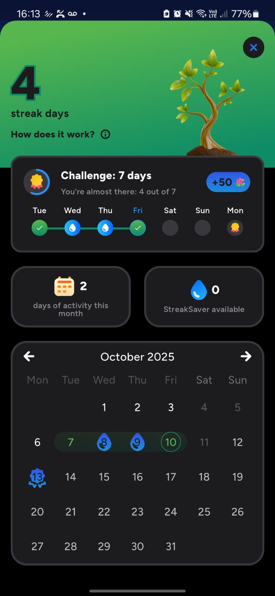

- #### Feature: Community Engagement Tools
  The application includes a group and a chronological activity feed to foster a sense of a global community. These tools allow users to see other users profiles and see the sustainable actions others are taking, though they lack features for social proof like photo sharing and chat communication.

**Visual Evidence:**
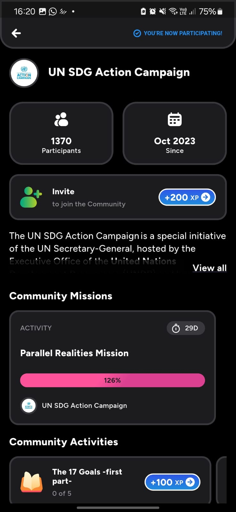

---

#### Strengths (Pros):

- **Strong Credibility and Authority:** As the official app of the UN's "Act Now" campaign, it has a high level of trust and authority that is difficult for other apps to replicate.
- **Effective Educational Positioning:** The app successfully positions itself as an educational tool, which is a strong draw for users looking to learn more about sustainability.
- **Clear Onboarding with Footprint Calculation:** The initial questionnaire provides a clear and personalized starting point for users, helping them understand their specific impact from the beginning.
- **Fosters a Sense of Global Mission:** The focus on large-scale, collective Targets can be highly motivating for users who want to feel part of a worldwide movement for positive change.

#### Weaknesses (Cons):

- **Lack of Direct, Small-Group Competition:** The app's primary weakness, in the context of our project, is its focus on collective achievement rather than direct rivalry between friends. This is the key market gap CarbonFighter aims to fill.
- **No "Social Proof" via Photo Sharing:** The app does not include photo sharing in its activity feed, missing a key engagement and validation mechanism that is highly successful in social fitness apps like GymRats.
- **Limited User Agency in Group Creation:** Group creation is limited to admins, which restricts the user-driven, spontaneous creation of challenges that is central to the GymRats model.
- **Inflexible Group Structure:** The app only offers one type of group ("Collective Challenges"), lacking the flexibility of offering both time-bound competitions and ongoing communities ("Clubs").

---

### 2.2 GymRats

GymRats is a social fitness application designed to make exercise engaging through community challenges, progress sharing, and friendly competition. Its main purpose is to motivate users to stay consistent with their fitness routines by tracking workouts, earning achievements, and interacting with peers in a gamified environment.

#### Features and Characteristic Analysis

- #### Feature: Workout Tracking and Progress Visualization
  GymRats enables users to log workouts manually or automatically through wearable devices. Each activity contributes to personal statistics and is displayed in your timeline.

**Visual Evidence:**

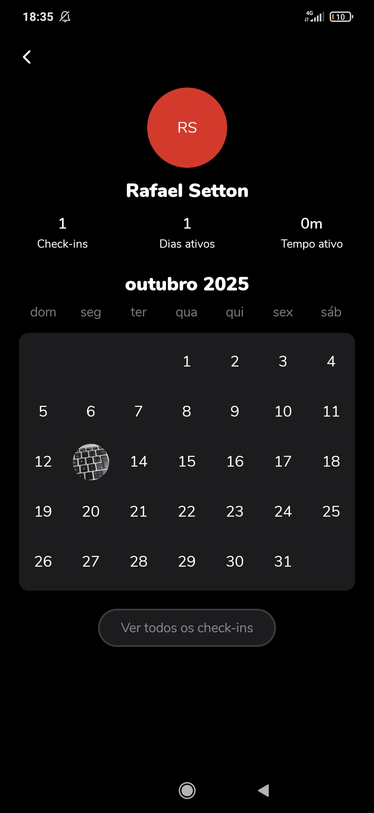

- #### Feature: Competitive and Collaborative Challenges
  Users can join or create fitness challenges, either competitive (ranked leaderboards) or collaborative (group progress toward shared Targets). This dual mode promotes both rivalry and teamwork, catering to different motivational styles.

**Visual Evidence:**  

- #### Feature: Social Feed and Media Sharing
  The app features a social feed where users post reactions, comments, and peer validation, encouraging consistent participation.

**Visual Evidence:**  

---

#### Strengths (Pros):

- **Flexible Challenge System:** GymRats effectively combines both competitive and cooperative formats, appealing to a wider range of users compared to purely collective models like AWorld.
- **Persistent Communities (Clubs):** The Club structure extends user retention by offering ongoing, identity-based engagement beyond time-limited events.
- **Strong Integration with Fitness Devices:** Support for wearable tracking enhances data accuracy and reduces friction in activity logging.

#### Weaknesses (Cons):

- **Potential for Superficial Engagement:** The emphasis on social proof and visuals can shift focus toward appearance rather than holistic well-being or performance.
- **Overreliance on Network Effects:** The app’s value significantly depends on user base activity. New or isolated users may struggle to find motivation without active friends or Clubs.
- **Minimal Guidance for Beginners:** While experienced users benefit from challenge variety, beginners might find the absence of structured onboarding or progressive plans overwhelming.

---

### 2.3 Earth Heroes

In this application, the following features were evaluated: Sustainable action scoring, Community and group integration, and Target setting.

#### Sustainable Action Scoring

On the home screen, the Actions tab is easily identifiable at the bottom of the screen, which facilitates access. When clicking on the corresponding icon, the user is directed to a section that displays their completed actions and current Targets.

**Visual Evidence:**

  
  

At the top, there is a tab dedicated to searching for new actions. The actions are organized by category, making navigation simple and intuitive. When selecting an action, the user can mark it as completed and receive the corresponding points.

**Visual Evidence:**

  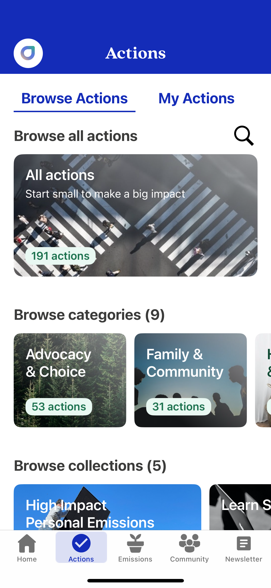
  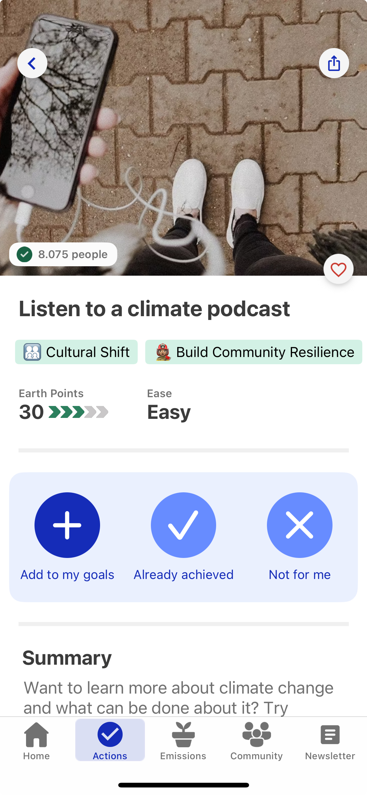

There is no verification process to validate task completion. Furthermore, each action can only be scored once, even in cases involving continuous habit changes, such as adopting a fully plant-based diet.

**Visual Evidence:**
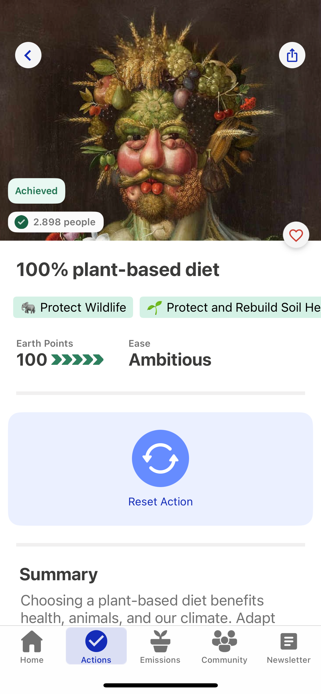

#### Community and Group Integration

On the home screen, the Communities tab is easily identifiable at the bottom of the interface. Upon accessing it, the user is directed to the “Discover Climate Organizations” section, where they can explore various initiatives. By clicking on any of them, the app displays a brief description of the organization and offers a button that redirects the user to the official website, outside the app.

**Visual Evidence:**

  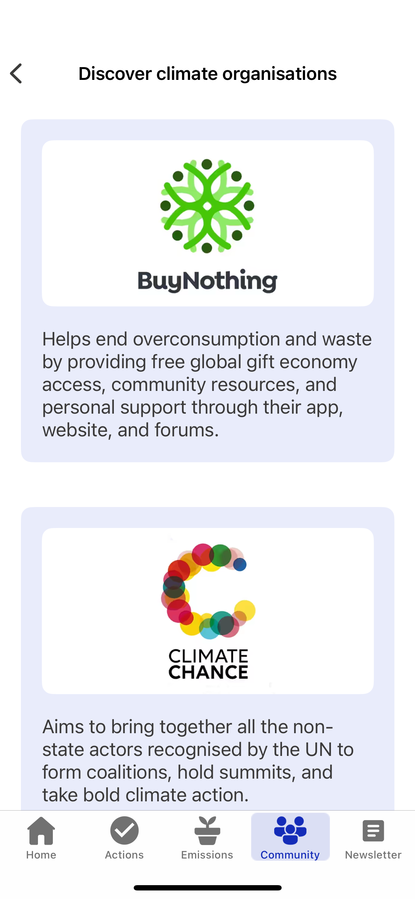
  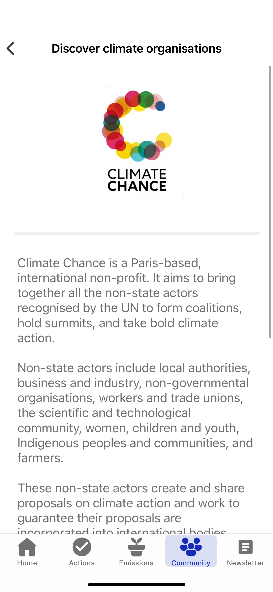
  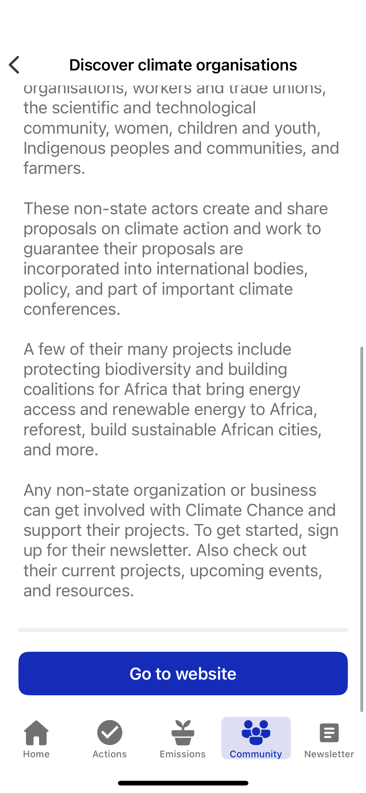

Earth Heroes does not include features for creating or interacting with internal communities. The Communities tab functions only as a gateway to external organizations, without offering mechanisms for direct engagement between users. Consequently, it is not possible to view or compare friends’ scores within the app itself.

#### Target Setting

On the home screen, there is no specific tab for “Targets” or objectives. However, by accessing the Emissions tab, users can find the “Set a target” section, where they can define their carbon emission reduction Target.

**Visual Evidence:**

  
  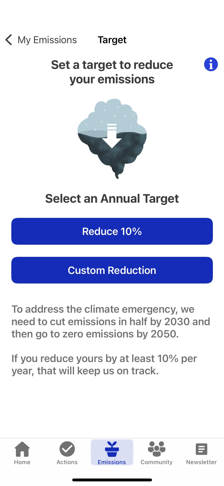

In this area, the app allows users to establish a personal reduction percentage but does not offer the option to create Targets based on “Earth Points.” This limitation may reduce user motivation to perform certain actions that, while environmentally beneficial, do not directly affect their personal emissions.

---

#### Strengths (Pros):

- **Intuitive Navigation:** The app features a user-friendly interface with clearly labeled tabs, facilitating easy access to different sections.
- **Clear Action Categorization:** The app organizes sustainable actions into categories, making it easy for users to find and complete them.
- **Simple Action Completion Process:** Users can quickly mark actions as completed, facilitating engagement.

#### Weaknesses (Cons):

- ** Lack of Internal Community Features:** The absence of features for creating or interacting with internal communities limits user engagement and social motivation.
- **No Verification for Action Completion:** The lack of a verification process for completed actions may lead to inaccuracies in scoring and reduced user trust.
- **Limited Target Setting Options:** The inability to create Targets based on “Earth Points” may reduce motivation for users to engage in a broader range of sustainable actions.

---

## 3. Synthesis and Final Analysis

While existing sustainability apps like **AWorld** and **Earth Heroes** focus on education, individual tracking, or large-scale collective goals, they lack the engaging, user-driven, small-group competition mechanics that have proven highly successful in the social fitness space, exemplified by **GymRats**.

Our strategic path is to combine the best of both worlds: the credible, habit-forming features of the eco-apps with the powerful social competition engine that makes GymRats so addictive. Our app's Unique Value Proposition (UVP) will be its focus on making sustainability a **fun, social, and competitive activity among friends**.

### 3.1 General Patterns and Observations

* **Common Patterns:**
    * **Gamification is a core pillar:** All analyzed sustainability apps (AWorld, Earth Heroes) utilize gamification elements like points, badges, and challenges to drive user engagement.
    * **Manual Logging is the standard:** The primary method for tracking sustainable actions is manual user input, often from a predefined and categorized list.
    * **Community is a goal, but implementation is weak:** While apps aim to create a sense of community, the execution often lacks direct interaction. AWorld has a passive global feed, and Earth Heroes only links to external organizations, leaving a gap for intimate, in-app social features.

* **Innovative Highlights & Key Opportunities:**
    * **Flexible Group Competition (from GymRats):** The ability for users to create their own groups and choose between time-bound "Challenges" and ongoing "Clubs" is a powerful model for sustained engagement that is absent in the eco-app market.
    * **Social Proof (from GymRats):** The "pics or it didn't happen" mechanism of requiring photo evidence is a key differentiator that increases accountability, engagement, and social sharing. This is a significant feature missing from competitors.

* **Identified Market Gap:**
    * There is no dominant application that focuses on **direct, small-group rivalry** for sustainability. The current market leans towards individual responsibility or vague collective action, missing the powerful motivator of friendly competition.

### 3.2 Elicited Requirements and Features of Interest

Based on the analysis, the following core requirements have been elicited. These will form the foundation for our product's Epics and User Stories.

* **User-Created Groups:** The system must allow any user to create groups, with options for privacy (public, private, invite-only). This empowers users and fosters organic community growth.

* **Flexible Competition Formats:** The system must support two distinct group types:
    * **Challenges:** Time-bound competitions with a clear start/end date and a winner.
    * **Clubs:** Ongoing communities for long-term accountability, with leaderboards that can reset on a cycle (e.g., monthly).

* **Real-time Leaderboards:** The system must display a real-time leaderboard within each group, ranking members based on their "Eco Points" to fuel competition.

* **Manual Activity Logging:** The system must provide a simple interface for users to log their sustainable actions from a categorized and predefined list.

* **Social Proof with Visual Evidence:** The system must allow users to attach a photo to their logged activities to validate their actions and share them on a social feed.

* **Integrated Group Chat:** The system must include a dedicated real-time chat feature within each group to allow for communication, motivation, and social interaction.

* **Gamification Engine:**
    * **Points System:** The system must award users "Eco Points" for completing sustainable actions.
    * **Daily Streaks:** The system must track and visually represent a user's streak of consecutive days with at least one logged action to encourage daily engagement.
    * **Achievements/Badges:** The system must award users badges for reaching predefined milestones (e.g., number of actions logged, streak length, challenges won).

* **Onboarding Footprint Calculator:** The system should offer a simple, questionnaire-based tool for new users to calculate their initial carbon footprint, providing a personalized starting point.