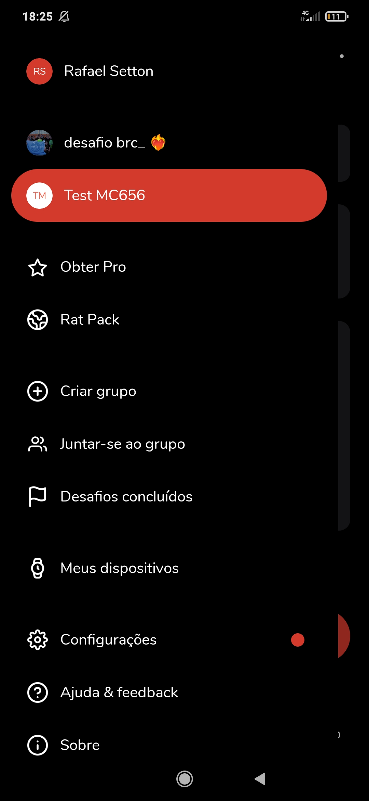

# Benchmarking Analysis

## 1. Overview and Selected Applications

For the requirements elicitation of the project, we conducted a market analysis to identify established features, gather innovative ideas, and understand UI/UX best practices in similar applications.

The following applications were selected for analysis:

- [Gymrats](https://www.gymrats.app/) (Fitness app that allows users to create and join training challenges with friends and family)
- [Earth Hero](https://www.earthhero.org/es/) (Global app for measuring carbon footprint and eco-friendly actions)
- [Gira](https://gira.com.ec/) (Ecuadorian waste management project that promotes the circular economy through recycling)
- [AWorld](https://aworld.org/) (The official app for the UN's "Act Now" campaign, using educational content, gamified challenges, and collective goals to promote sustainable habits)

---

## 2. Detailed Application Analysis

### 2.1 AWorld

"Act Now" serves as the official app for the United Nations' campaign, functioning as an educational tool with strong credibility. Its main purpose is to engage a global community in climate action by allowing users to calculate their carbon footprint and participate in gamified challenges to collectively save CO2, water, and energy.

#### Features and Characteristic Analysis

- #### Feature: Questionnaire-Based Carbon Footprint Calculation
  The app calculates a user's initial carbon footprint through a guided questionnaire about their lifestyle habits. This feature provides a personalized baseline, giving users a tangible starting point and a metric against which they can measure their progress.

**Visual Evidence:**

- #### Feature: Collective Goal-Oriented Gamification
  AWorld employs a gamification system with points, levels, and badges to motivate users. However, its competition mechanics are focused on collective achievement rather than direct rivalry. Users participate in time-based, public "Collective Challenges" where they contribute to a large-scale shared goal, such as a global reduction in CO₂.

**Visual Evidence:**

- #### Feature: Daily Streak Challenge
  This feature stimulates the user to open the app daily to maintain their engagement streak. It offers rewards within the gamification system for users who successfully keep their streak active.

**Visual Evidence:**

- #### Feature: Community Engagement Tools
  The application includes a group and a chronological activity feed to foster a sense of a global community. These tools allow users to see other users profiles and see the sustainable actions others are taking, though they lack features for social proof like photo sharing and chat communication.

**Visual Evidence:**

---

#### Strengths (Pros):

- **Strong Credibility and Authority:** As the official app of the UN's "Act Now" campaign, it has a high level of trust and authority that is difficult for other apps to replicate.
- **Effective Educational Positioning:** The app successfully positions itself as an educational tool, which is a strong draw for users looking to learn more about sustainability.
- **Clear Onboarding with Footprint Calculation:** The initial questionnaire provides a clear and personalized starting point for users, helping them understand their specific impact from the beginning.
- **Fosters a Sense of Global Mission:** The focus on large-scale, collective goals can be highly motivating for users who want to feel part of a worldwide movement for positive change.

#### Weaknesses (Cons):

- **Lack of Direct, Small-Group Competition:** The app's primary weakness, in the context of our project, is its focus on collective achievement rather than direct rivalry between friends. This is the key market gap CarbonFighter aims to fill.
- **No "Social Proof" via Photo Sharing:** The app does not include photo sharing in its activity feed, missing a key engagement and validation mechanism that is highly successful in social fitness apps like GymRats.
- **Limited User Agency in Group Creation:** Group creation is limited to admins, which restricts the user-driven, spontaneous creation of challenges that is central to the GymRats model.
- **Inflexible Group Structure:** The app only offers one type of group ("Collective Challenges"), lacking the flexibility of offering both time-bound competitions and ongoing communities ("Clubs").

---

### 2.2 GymRats

GymRats is a social fitness application designed to make exercise engaging through community challenges, progress sharing, and friendly competition. Its main purpose is to motivate users to stay consistent with their fitness routines by tracking workouts, earning achievements, and interacting with peers in a gamified environment.

#### Features and Characteristic Analysis

- #### Feature: Workout Tracking and Progress Visualization
  GymRats enables users to log workouts manually or automatically through wearable devices. Each activity contributes to personal statistics and is displayed in your timeline.

**Visual Evidence:**

- #### Feature: Competitive and Collaborative Challenges
  Users can join or create fitness challenges, either competitive (ranked leaderboards) or collaborative (group progress toward shared goals). This dual mode promotes both rivalry and teamwork, catering to different motivational styles.

**Visual Evidence:**  

- #### Feature: Social Feed and Media Sharing
  The app features a social feed where users post reactions, comments, and peer validation, encouraging consistent participation.

**Visual Evidence:**  

---

#### Strengths (Pros):

- **Flexible Challenge System:** GymRats effectively combines both competitive and cooperative formats, appealing to a wider range of users compared to purely collective models like AWorld.
- **Persistent Communities (Clubs):** The Club structure extends user retention by offering ongoing, identity-based engagement beyond time-limited events.
- **Strong Integration with Fitness Devices:** Support for wearable tracking enhances data accuracy and reduces friction in activity logging.

#### Weaknesses (Cons):

- **Potential for Superficial Engagement:** The emphasis on social proof and visuals can shift focus toward appearance rather than holistic well-being or performance.
- **Overreliance on Network Effects:** The app’s value significantly depends on user base activity. New or isolated users may struggle to find motivation without active friends or Clubs.
- **Minimal Guidance for Beginners:** While experienced users benefit from challenge variety, beginners might find the absence of structured onboarding or progressive plans overwhelming.

---

## 3. Synthesis and Final Analysis

[comment]: # '*This final section is crucial. Here you will consolidate all the learnings from the analysis.*'

From AWorld the main features that can be used are the carbon footprint calculation, that can recieve modifications to serve the porpouse of CarbonFighthers better, the streak, for estimulationg users using the application every day and the gamification system along with it, and adapt the community feature to be groups more simmilar to the gymrats version.

### 3.1 General Patterns and Observations

[comment]: # '*Based on the analysis of all applications, list the most important patterns and observations. What do they have in common? What stands out as a market trend?*'

- **Common Patterns:** (e.g., "Most applications divide content into topics and subtopics and use a gamification system to engage users").
- **Innovative Highlights:** (e.g., "The feature to export content as Markdown from 'Notion' is a major differentiator for advanced users").
- **Common Weaknesses:** (e.g., "We noted that keyboard accessibility is a weak point in most applications that use interactive maps").

### 3.2 Elicited Requirements and Features of Interest

[comment]: # '*Translate your observations into a list of potential requirements or features for your project. This list will be the foundation for creating your Epics and User Stories.*'

- **Streak**: The system should ...
- **Carbon Footprint Calculation**: The system should ...
- **Groups**: The system should allow the cration of groups with chats and scoreboards...
- **[Requirement 4]**: (e.g., Implement a newsletter system for user engagement).
- ...
